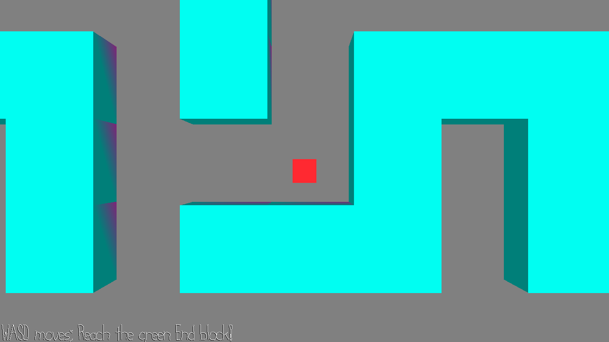

# Random Mazer

Author: Patrick Huang (pbhuang)

Design: The most interesting part of the game is the random maze generation done using a variation of Prim's algoritm. This maze generation 
technique was inspired from reading my 122 lecture notes where it was briefly mentioned in the spanning tree lectures. The maze is created by finding a spanning tree of all the open spaces (the spaces in between each wall) and then wherever there is a spanning tree edge across a wall,
that wall is removed. Beacause of this spanning tree approach, it guarantees every space in the maze is reachable to every other space; there will always be a route from the start to the end. The randomness comes from using a pseudo-random number generator combined with the time function when
the code is run to pick random indexes into the set of edges during prim's algorithm. Thus if you close and rerun the game multiple times, the maze generated should be different each time!

One constraints I had with this project was that each wall is one cube mesh in Blender. When coding up the game logic without any visuals and using console-based output to see the maze, I was easily able to generate pretty large mazes (30x30 size in the [SPACES_BOARD_SIZE](Game.hpp)). But to do that with the actual 3D view, I would have needed to make 900 separate Blender blocks, which I definitely didn't want to do, and I didn't have the time to figure out how to programmaticaly make Blender models with Blender scripts. So that's why the SPACES_BOARD_SIZE](Game.hpp), which is the overall maze size, is constrained to a max of 7 right now. You can play with numbers below 7 but if you go above to 8, many of the logical walls will be invisible in 3D because there is not enough Blender models for it. 

Screen Shot:

How To Play:

WASD to move around the player. The camera is always centered on the player You start in the bottom left of the maze. The goal of the game is to reach the Green cube in the top right of the maze!

Sources: All my blender models were made in scenes/maze.blend. I then used that blend file to make dist/maze.scene and dist/maze.pnct.

This game was built with [NEST](NEST.md).

